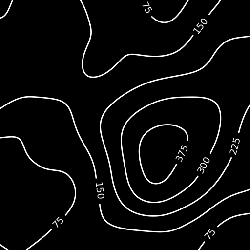

# TopoVision

**AI-powered extraction of 3D terrain models from 2D topographical maps.**


---

## 📖 About the Project

**TopoVision** is a research initiative by the **KTH AI Society** in collaboration with **ReGen Villages**.

Current architectural and civil engineering workflows face a bottleneck: converting 2D topographical maps (contour lines) into usable 3D digital assets often requires tedious manual data entry. **TopoVision** automates this by using computer vision to translate static height curve maps into dynamic 3D meshes.

### Key Features

* **Computer Vision Pipeline:** Will use deep learning to interpret height curves and visual features from standard images.
* **Synthetic Training Pipeline:** Solves data scarcity by utilizing a custom Perlin noise generator to create diverse training scenarios.
* **Automation:** Aims to remove the human-in-the-loop requirement for initial terrain drafting.

---

## 📸 Examples

*Below is a sample of the synthetic topographical data generated by our pipeline for training purposes.*



---

## 🛠️ Development Setup

This project utilizes `uv` for dependency management and execution.

### Prerequisites

* [uv](https://github.com/astral-sh/uv) installed.

### Pre-commit Hooks

We use pre-commit hooks to automatically check and format code (`ruff`) before commits to ensure code quality.

**1. Install hooks:**

```bash
uv run pre-commit install
### Pre-commit Hooks

This project uses pre-commit hooks to automatically check and format code before commits.

**Install hooks:**

```bash
uv run pre-commit install
```

**Run hooks manually:**

```bash
uv run pre-commit run --all-files
```

The hooks will automatically run `ruff check` and `ruff format` on all Python files and Jupyter notebooks before each commit.

## Synthetic Data Generation

This project includes a tool to generate synthetic contour maps with rotated text annotations, useful for training OCR and segmentation models.

**Generate data:**

```bash
uv run python src/data_generation/perlin_noise_generator.py
```

**Output:**

The generated data will be saved in `data/synthetic/perlin_noise`.
The output includes:

* **Images:** Synthetic contour maps with text labels.
* **Masks:** Segmentation masks showing only the contour lines without text labels (images ending in `_mask.png`), suitable for training segmentation models.
* **Debug Images:** Visualizations of the bounding boxes and polygons.
* **Annotations:** A `coco_annotations.json` file containing the annotations in COCO format (used for OCR training).

## 👥 Contributors & Affiliations

**Research Team:**

* Mattias Kvist – Research Lead
* Erik Lidman Hillbom – Researcher
* Edoardo de Cal – Researcher

**Affiliations:**

* [KTH AI Society](https://kthais.com)
* [ReGen Villages](https://www.regenvillages.com)

**Project Timeline:** Nov 2024 – Jan 2025  
[View Project Board](https://github.com/users/mattiaskvist/projects/4)
